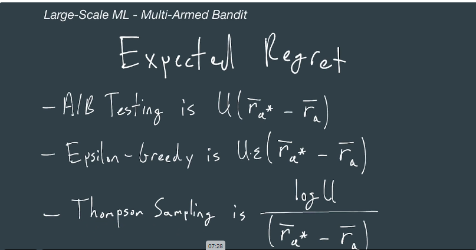

## Data Support

### Data Ingestion

#### Clickstream

An ordered series of interactions that users have with some interface. In the traditional sense, this can be literal clicks of a mouse on a desktop browser. Interactions can also come from touchscreens and conversational user interface

#### Change Data Capture

The process of recording changes in the data within the database system. For instance, if a user cancels their Netflix subscription, then the row can be recorded and referenced later for analysis or audit purposes
Producer -> Broker Cluster -> Consumer (Storage)
binlogs
segment idx
change streams

#### Apache Kafka

An open-source software platform which provides a way to handle real time data streaming
(Inside of Apache Kafka)
Producers (Clickstream logs) -> Broker Cluster with Leader Election and Replication (Zoo Keeper) -> Consumer (Storage)

#### Amazon Kinesis

An AWS product that provides a way to handle real-time data streaming
Producers (Clickstream logs or any streaming data for ingestion) -> Shards -> Consumers(Storage)

#### Zookeeper

A service designed to reliably coordinate distributed systems via naming service, configuration management, data synchronization, leader election, message queuing, or notification systems

#### Database

A tool used to collect and organize data. Typically, database management systems allow users to interact with the database

#### OLTP

Online transaction processing. A system that handles (near) real-time business processes. For example, a database that maintains a table of the users subscribed to Netflix and which is then used to enable successful log-ins would be considered OLTP. This is opposed to OLAP.

#### OLAP

Online analytical processing. A system that handles the analytical processes of business, including reporting, auditing, and business intelligence. For example, this may be a Hadoop cluster which maintains user subscription history for Netflix.

Producer (OLTP) -> Broker Cluster -> Consumer (OLAP)

#### Availability Zone

Typically a single data center within a region which has two or more data centers. The term multi-AZ implies that an application or software resource is present across more than on AZ within region. This strategy allows the software resources

#### Live Videos / Live Streams

- Ingesting video content from traffic cameras, security cameras, video streaming services
- Example: HTTP Live Stream HLS
  - H.264 compression
  - AAC for sound
  - Effectively chops MP4s up into segments send them out over HTTP

Producers -> Collector Layer -> Broker Cluster -> Consumer (Storage)

- Cameras

#### Batch Ingestion

- Databases - Periodic 'snapshots' of the databases - Useful when onboarding a new database to be ingested
  Producer -> Broker Cluster -> Consumer
- mySQL mysqldump
- Cassandra CQL copy
- MongoDB mongoexpert

#### Ingestion Consideration

- Size of individual data
- Rate at which data comes in
- Support of data types (changing data types)
- High-availability(multi-AZ) and fault tolerance

### Data Storage

#### Hard Disk Drive

A storage device which operates by settings bits on a spinning magnetic disk. THe capacity and the read/write performance of the HDD are the main characteristics to consider when using an HDD within a particular system

#### Data Replication

A strategy used to mitigate the potential data loss in the event of a system or component failure. IIN the most basic form, it involves writing identical data to more than one device or location. MOre efficient techniques like erasure coding incorporate mathematics to recover lost data without referring to an explicit copy of the data.

#### Hadoop Distributed File System

An open-source Apache software product which provides a distributed storage framework
-> Name Node Cluster with hot stand by - Keeps track of which bit of data goes where
Request -> HDFS Client -> Data Node 2
-> Data Node 1

Uses erasure coding instead of simple replication with an XOR to create a parity bit or something more advance like Reed-Soloman encoding

Sometimes data replication can happen through the process of the producer, broker, and consumer acknowledgements to prevent that we can use Kafka Connector sink -> Exactly-once Semantics

Connects broker and consumer, will guarantees no duplicates

#### Avro

A row-oriented data serializer provided by Apache

- Good for queries which need all columns
- Good for heavy write load
- JSON schema supports evolutions

#### Parquet

A column-oriented data storage format provided Apache

- Good for queries which need some columns
- Good for heavy read load
- Schema challenged with evolution
- Good for sparse data
- Good compression performance

#### Exactly-once Semantics

Guarantees that an object within a distributed system is processed exactly once. Other semantics include maybe, at-least-once and at-most-once

#### Kafka Transactions

- Uses unique transactional IDs for each producer tied to metadata to ensure that each data committed to the broker is complete -> Sometimes Kafka Streams API simplifies code

### Data Processing

Given the example where we want to predict whether a user will cancel their subscription

Where the data pipeline would look like
Producers(Clickstream logs) -> Broker Cluster (Kafka) -> Consumer (HDFS Data Node)

Message Processing would include

- Aggregation
  - counting how many searchers per user
- Join
  - Combining messages from separate click stream events
- Transformations
  - Nth month of the year instead of the date

Requirements for this structure

- Cluster resource management (CPU, RAM)
- Computational dependency management (locality)
- Manage saving final results to HDFS
- Bonus: Share same HDFS cluster

For this example we'll use Apache Spark and Apache Yarn installed on HDFS cluster

The interaction between Spark and Yarn is that

YARN AM -> Spark Driver
YARN containers <- Spark Executors

Resource manger -> Node manager: AM -> Driver, Container-> Executor
|-> Node manager: Container-> Executor

With this the single point of failure would be resource manager, so we could add zookeeper with an active/passive hot-standby

#### Recommendation Carousel

A component within a graphical or conversational user interface which presents recommendations to a user. This can include products, ads, and media content.

#### Central Processing Unit

A general purpose compute resource responsible for executing computer programs.

#### Seasonality

The predictable changes of data throughout the calender year

#### Parallelization

When two or more computer programs are executed at the same instant across more than one processor.

#### Random Access Memory

A device on a computer which stores the data and machine code of a running computer program

#### Apache Spark

A software interface which provides implicit parallelism and fault tolerance across a cluster of machines - Gives users ease of access to run code across cluster

- Driver
  - Converts user's code to a set of tasks (unit of work)
  - Schedules tasks across executors
- Cluster Manager
  - YARN schedules jobs submitted to cluster
- Executor
  - Runs tasks
  - Returns results to drivers

Action Flow:
Driver will receive a job
Driver will

- Verifies schema, types, data structures
- Optimizes your code, with an 'optimized logical plan'
  - Reduce code to RDD DAG (Resilient Distributed Dataset Direct Acyclic Graph)
  - DAG Scheduler (stages)
  - Task scheduler
- Form physical plan
  - Creates tasks and DAG schedulers, will then execute this plan with task schedulers
  - Executors will return results to Driver

#### Apache YARN

A software product responsible for managing compute resources across a cluster of machines

- A resource negotiator that
  - Scheduler allocates cluster resources
  - Applications manager accepts jobs to be run on cluster
- Node Manager (Per-node)
  - Negotiates with Resource manager for resources requested by Application Master AM
- Application Master
  - Reports resource usage to resource manager
  - Negotiates with the scheduler for containers
- Containers - Abstraction representing RAM CPU DISK
  Action flow:
  Client sends a task to resource manager
  Resource manager the starts a container an application master on the node manager
  Application master can ask for more resources from the resource manager
  Resource manager will tell the AM where free nodes resources are and starts those containers
  Containers will run code
  To check in on the processes, you get status from AM
  After its done the AM will deregister with the RM
  RM will clean up the resources that were deregistered

#### Elastic MapReduce

An Amazon Web Services product which provides users access to a Hadoop cluster

#### Jupyter Notebook

A project jupyter product which provides an interactive workspace to execute code.

### Processing Orchestration

In an example where we want to get fresh data every 24hrs

- Get interaction data from the search page and the carousel
- Merge interaction data into one dataframe
- Join interaction features with labels
- Ideally not to do this manually
- Handle data dependencies (serial, parallel)
- Manage potentially thousands of scheduled jobs
- We can here use Apache Airflow

#### Apache Airflow

A workflow management system that provides users a way to author, schedule and execute software

- DAG Directed Acyclic graph
  get_data_A -\
   join_AB ----\
  get_data_B -/ join_ABC
  get_data_C -/
  Airflow offers
- Webserver (Multiple instances behind load balancers)
  - Flask app allows users to trigger DAGs
  - Browse DAG history (stored in database)
- Scheduler - Can be set with active/passive hot standby and support concurrency without can be single point of failure - also reduces duplications
  - Monitors database to check task states
  - Fetch DAGs from DAG store (S3 DFS)
  - Send DAG tasks to execution queue (Could be RabbitMQ which can be scaled for availability)
  - Writes DAG runs to database (Will have to active/passive hot standby as well) for history
- Worker
  - Pulls the task queue
  - Runs the tasks
  - Stores task state to the database
  - Implemented through celery worker
    - If one of worker goes down, celery will reassign the work

Action flow:
User will trigger the DAG in the webserver
Webserver fetc DAG from DAG store like S3
Webserver will schedule the DAG with scheduler
Scheduler enqueue Tasks in parallel to the Queue
Works will constantly pull tasks to work on and write to database when complete
Scheduler will periodically check if tasks are done
This allows schedulers to then queue more jobs that were dependent on other jobs to get done
When all tasks ae done then scheduler will add DAG History to the Database
This allows webserver to getDAGStatus
And webserver will relay to client DAG status

- Check stats of DAG Run
- Failures
- Runtime
- Can alter schedule

## Exploration

### Workspaces

- Explore features, labels, and models
  - Completeness of data
    - Stability
    - Availability
    - Free of bias
      - Positive feedback loop
  - Pre-trained models
    - Transfer learning
      - Embedding layers
  - Explainability
    - Shapley values
    - Lime
    - Deeplift
  - Model types
    - Layered, ensemble, auto-ml
  - Feature importance
- Leverage team resources
  - Team packages
  - Collaboration
- Environment management
  - Individualized exploration
  - Production-ready for serving predictions
- Spark/HDFS access
- Asynchronous support
  - Training, hyperparameter tuning, evaluation
- Data access governance
  - Protected data

Tools:

- Jupyter hub / notebooks
  - Amazon sagemaker studio
  - Google collab
  - Azure ML workspace

#### Automated Machine Learning

A strategy which automates the process of applying features and labels to a machine learning model

#### Data Governance

The method of managing, using, and protecting an organization's data

## Experimentation

Form hypothesis

- Replace user experience with another
  - Recommendation algorithm changes
  - UI Changes
  - Demand forecasting viewers of a new release
  - ML-based web caching
- Dependent variable selection
  - incremental profit or revenue
  - number, rate, or probability of ads clicked
  - listening / screen time
- Directionality of dependent variables
  - Anticipate multiple changes
- Experiment participate - country , new users/longtime users, platform type
  "If we replace x with y for some set of users [a,b,c] will go [up/down] and [invariants] won't change"

### Frequentist AB Testing

Frequentist Approach

- Base line
  - what the current control experience offers in terms of a metric we care about
- Minimum detectable change
  - smallest effect that can be measured
  - practical significance boundary
- Power
  - percent of the time minimum detectable change is found assuming it exists
  - 1-probability
- Significance
  - percent of time minimum detectable change is found assuming it doesn't exist
  - alpha
- Sample Size
- Null hypothesis
  - The case of our hypothesis being incorrect such that there's no difference between control and treatment
  - Accepting or rejecting
- p-value
  - probability of seeing the results or greater by random chance if run many times
  - 0.05
- confidence interval

#### A/B Testing

The process of providing two or more different experiences across two or more subgroups of a population. The goal is the measure the change in behavior of the subgroups upon receiving the respective experiences

- Control group in which the experience is unchanged so that we can compare a treatment group
- Determine if treatment should replace control
- results extrapolation - run for at least two weeks
    - through time (seasonality)
    - through population (differ from sample)
- change effects 
    - novelty effect
    - change aversion
        - users don't interact with something just because its new
- time-intensive feedback
    - invariants can change or be introduced

User -> App -> getAllocation: User Allocator
User Allocator assign group A or B through cookie -> App -> User
App -> recordData: User Allocator
User Allocator -> DB Ingestion -> HDFS Cluster

Tools
- Optimizely
- Google Optimize
- Facebook PlanOut

#### A/A Test

An A/B test in which the experience being tested are identical to one another. THis is done in an effort to determine statistical validity of the A/B tool, the metric being monitored, and the analysis process being used.
- differences shouldn't be usually statistically significant p-value<0.05
- verify a/b testing tool
    - sample bias
    - incorrect analysis process
- overly sensitive metrics
    - can be used to get MDC

#### User Agent

An identifier used to describe the software application which a user is using to interact with another software application. For instance, an HTTP request to a website typically includes the user agent soo that the website knows how to render the webpage.

#### Session ID

A unique identifier assigned to a user to keep track of a user's connected interactions. For instance, a session may include a user logging in, purchasing an item, and logging out. Here, the session ID would be used to reference the group of those three interactions. This session ID can be stored in the user's internet browser as a cookie

#### Cookie

A small piece of data stored by a browser which indicates stateful indicates stateful information for a particular website. For instance, a cookie can be stored in your browser after you log in to a website to indicate that you are logged in. This will stop subsequent pages from asking you to log in again.

### Bayesian AB Testing
Similar as A/B testing but interpreting the results is different which is using bayes rule
```P(H|D)=/frac{P(D|H)*P(PH)}{P(D)}```
Main takeaway Posterior and Prior will be part of the same type of distribution
- Goal is to know Probability of B being greater than A 
  - Sample from A and B posterior and get the percentage of cases where B>A
- Loss
  - The result of choosing B over A if B is actually worse than A
  - Sample the difference between A and B
- Expected Loss
  - Takes into account probability of B being greater than A
  - As well, the loss if B is worse than A
  - Same unit as metric
  - Assuming B>A, if not: P(A>B)*Max(CTP_A-CTP_B,0)
- Stopping criterion 
  - If expected loss is less than some threshold, then stop
  - Threshold should be something that you're comfortable losing or a don't care position

Bayesian v Frequentist
- Easier to interpret results
- OFten fewer samples to reach launch decision which means faster experiments and improvements

Tools
- Visual web optimizer
#### Beta Distribution

This distribution is used to model percentages and proportions such as click-through probabilities

### Multi-Armed Bandit
- Minimize the negative business impacts while still experimenting at a reasonable pace

Explore/Exploit Trade off
- We could explore the less promising treatment but miss a potentially better control
- We could exploit the potentially better control but miss an eventually better treatment

We could use Epsilon-greedy strategy - depending on which has a better response you can dynamically assign the partition on your group
- How much better is this strategy over random allocation A|B testing

Reward
- The outcome of allocating a user to a particular experience
- Total reward obtained by a MAB
  - Sum of rewards obtained by allocating user u to arm a
- Expected reward = Sum of Users average arm reward

Regret
- Reward obtained from optimal arm minus the reward obtain from the arm chosen
- Expected regret = Sum of users optimal arm reward - Sum of Users average  arm reward
- With epsilon-greedy we will have a fraction of regret


#### Multi-Armed Bandit
(Multi Arms are just different treatment groups)
A process which provides a number of choices

#### Thompson Sampling
The frequency a user should be allocated to an experience should equal the probability of that experience being optimal
- When to stop
  - 95% chance that the value remaining in the experiment is less than 1%

| MAB                                        | A\|B                                   |
|--------------------------------------------|----------------------------------------|
| Many Arms                                  | Few Arms                               |
| Move Traffic automatically to the best arm | Good when results are needed long term |
| Short term results                         | Focus on learning                      |
| Focusing on optimizing                     | But higher regret                      |
| but Longer experiment                      |                                        |

Practical Considerations
- How often to update beta distributions
- How long customers actions take to record
- Non-stationary user preferences
- Can be contextual

Tools:
- Optimizely
- Visual Web Optimizer
- Vowpal Wabbit (Contextual bandits)

### Impact Estimation
Pre-experiment
- How much will it cost?
  - Time
    - Minimum 2 weeks for the actual experiments
    - From 2 weeks to 2 months support work
      - Training data collection
      - Model creation
      - Experiment Infrastructure
      - Model Hosting 
      - Post-experiment analysis
  - Headcount (MLExpert)
    - 1 SWE
    - 1 Data Engineer
    - 1 Data Scientist
  - Opportunity Cost
    - Other non-ML projects
    - Other ML projects
  - Cost
- How much will it benefit the company/customer?
  - Pretend you build a perfect model, what does the results look like
  - Then take 1%, 2%, 5%, 10% of that 'perfect' result 
    - What would happen to 
      - Revenue/Profit
  - Compare those to the cost of experimentation
    - 100k to run experiments
    - 200k conservative from 250k potential upside
  - Decide on point of diminished return
  - What are the risks to the business?
    - Loss of CTP, conversions, session time, customer familiarity, customer trust
    - Data leakage
      - If collecting confidential data is required for your experimental models
    - Outages 
      - Any new software components incur risk
    - How quickly can we stop the experiment

Post-Experiment
- Is the experiment result valid?
  - Bins correction
    - Sample selection bins
  - Extrapolation appropriate
    - If done on holiday, payday, start of school
    - compare to the same time last year adjusted for normal growth
  - Statistically valid
    - Frequentist A|B p-values
    - Bayesian A|B probability B>A, expect loss
    - MAB value remaining 
  - Experiment collisions 
    - Was another experiment being done
      - Impacted the same user experience 
      - Impacted the same metrics
    - Carry over effects
  - Is the new experience worth launching?
    - Variants and invariants
      - Did the variants you expected to change actually change?
      - Did any invariant change?
      - Do any change in variants contradict?
    - Did customer service metrics change?
      - Spikes can indicate confusion or dissatisfaction 
    - Did any cannibalization occur?
      - Pushing one product over another can have unforeseen implications to another

#### Shadow Test

Running two or more versions of software in parallel while only surfacing the result of one of the experiences to the end user. THis is done in an effort to gauge the difference between the software versions
- Try to get some understanding of how new experiences behave

Client -> Homepage -> GetRecommendation -> New Experience -> New logs
              -> GetRecommendation -> Old Experience -> Old Logs

- Use logs 
  - Sanity check
  - Measure differences
  - Look for errors/faults
  - CPU/Memory/Disk/Latency


#### Sample Selection Bias

The bias that occurs when sampling a population into one or more subgroups at random results in a systematic inclusion or exclusion of some data.

#### Experiment Collision

The event where one experiment unintentionally influences the results of the one or more separate experiments

## Large-Scale Training

### Basic Models
Spark cluster + HDFS helps create features and labels
- We need to train models for exploration and likely automate training

Algo for large data sets:
- Gradient Boosted Tree
  - 100m Examples
  - 200 features each
  - Roughly 200 split points per feature
  - Code flow:
    - For ea. feature
      - For ea. split point
        - store_best
    - Recurse_left
    - Recurse_right
- Random Forest
  - Parallelize construction of each tree in the ensemble because no dependency like Gradient Boosted Tree would need to run computationally parallel
- Matrix Factorization
  - Alternating Least Sq
    - User embedded matrix * Product embedded matrix = original user product matrix 
    - We can split these up into different machines
      - Ordinary least q locking in on U
      - Ea. machine work on partial results and communicate to talk to each other
- Logistic Regression
  - Spread the parameters across the cluster
  - send mini batches to each machine 
    - execute model on mini batch send back to a machine
    - machine will aggregate these results together
- Generally ML algorithms have variations which can use parallelization
- This means a faster convergence to optimum parameter values


#### MLlib

A library provided by APache SPark which provides Spark clusters access to machine learning algorithms and related utilities. MLlib provides a Dataframe-based API which is unofficially referred to as SparkML
- Has implemented parallel versions of a lot of models
- Linear / Logistic regression
- SVMs
- GBT/RF
- Naive Bayes
- Collaborative Filtering
- Biesecting K-Means
- SVD/PCA
- Feature standardization
- TF-IDF
- Feature Hashing
- Stop word removal 
- One-hut encoding

### Deep Learning Models

#### Model Parallelism

A machine learning model training strategy used to maximize the utilization of compute resources in which the model is distributed across two or more devices

#### Data Parallelism

A machine learning model training strategy used to maximize the utilization of compute resources in which the model is distributed across two or more devices

#### Graphic Processing Unit

A specialized device that has many cores, allowing it to perform many operations at a time.
GPUs are often used within deep learning to accelerate training of neural networks by taking advantage of their ability to perform many parallel computations.

#### Concurrency

When two or computer programs share a single processor.

### Model Validation

#### Hyperparameters Optimization

The process of searching for the best possible values of the hyperparameters of some machine learning model

## Productionization

### Productionization

#### Recall

Also sensitivity, is the proportion of true positives which are correctly classified

#### Precision

The number of true positives divided by the true positives plus false positives.

## Hosting

### Data Hosting

#### In-memory Database

A database which relies either solely or primarily on the RAM of a computer

#### Distributed Cache

A cache which distributed across two or more machines

### Model Hosting

#### Numba

A just-in-time Python complier which resolves a subset of the python programming language down to machine code
